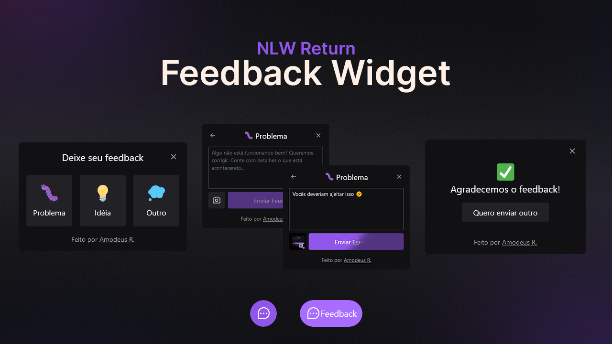

<!-- markdownlint-disable MD033 -->
<h1 align="center">NLW Return – Feedback Widget</h1>

This is the final project for Rocketseat's Feedback Widget challenge.

<h3 align="center">Languages</h3>

  <a href="#">English</a> • <a href="./lang/README.pt-br.md">Português</a>

<!-- markdownlint-enable MD033 -->

## Table of contents

- [Overview](#overview)
  - [The challenge](#the-challenge)
  - [Links](#links)
- [My process](#my-process)
  - [Built with](#built-with)
  - [What I learned](#what-i-learned)
- [Author](#author)

## Overview

### The challenge

- Create a Feedback Widget with integrated Backend service, responsivity and accessibility support
- Ensuring a well written code and unit testing the application
- Create a mobile version app

### Links

- Live Site URL: [Vercel App](https://nlw--feedback-widget.vercel.app/)

## My process

### Built with

- Frontend
  - React
  - Typescript
  - TailwindCSS
  - Axios
  - HeadlessUI
  - Phosphor React Icons
  - HTML2Canvas
  - Vite
- Backend
  - Typescript
  - Prisma
  - Jest
  - Nodemailer
- Mobile App
  - React Native
    - Gesture Handler
    - View Shot
    - Reanimated
  - Typescript
  - Bottom-Sheet
  - Phosphor React Icons
- Others
  - Vercel
  - Railway

### What I learned

Although the final result seems simple enough – just a feedback widget – it actually takes us on a long journey through many technologies, good practices and real world experience which would never be possible if not through a seemingly simple project. Nonetheless, fully complete in essentially all aspects.

Every inch of this project taught me something unique in a way or another. I had my first contact with many techs through this project – TailwindCSS, React Native, Prisma... – and reinforced others, whilst also learning about very important concepts, practices and much more about what we should do, why and how.

## Author

- [My Website](https://amodeusr.pages.dev)
- Github - [@AmodeusR](https://github.com/amodeusr)
- Linkedin - [@AmodeusR](https://www.linkedin.com/in/AmodeusR)
- Frontend Mentor - [@AmodeusR](https://www.frontendmentor.io/profile/AmodeusR)
