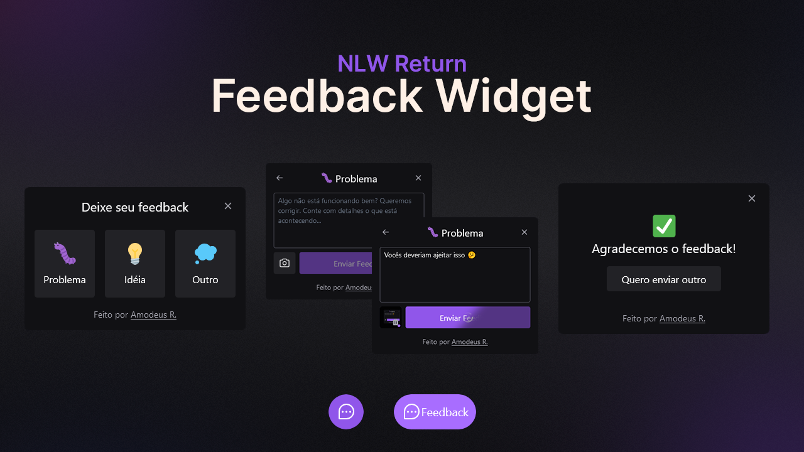

<!-- markdownlint-disable MD033 -->
<h1 align="center">NLW Return – Feedback Widget</h1>

Esta é a resolução ao desafio da Rocketset Feedback Widget

<h3 align="center">Idiomas</h3>

  <a href="../README.md">English</a> • <a href="#">Português</a>

<!-- markdownlint-enable MD033 -->

## Índice

- [Visão Geral](#visão-geral)
  - [O desafio](#o-desafio)
  - [Links](#links)
- [Meu processo](#meu-processo)
  - [Desenvolvido com...](#desenvolvido-com)
  - [O que aprendi](#o-que-aprendi)
- [Autor](#autor)

## Visão geral

### O desafio

- Criar um Feedback Widget com serviço de backend integrado, responsividade e suporte a acessibilidade
- Garantir um código bem escrito e fazer teste unitário da aplicação
- Criar uma versão app mobile

### Links

- URL para o Site: [Vercel App](https://nlw--feedback-widget.vercel.app/)

## Meu processo

### Desenvolvido com...

- Frontend
  - React
  - Typescript
  - TailwindCSS
  - Axios
  - HeadlessUI
  - Phosphor React Icons
  - HTML2Canvas
  - Vite
- Backend
  - Typescript
  - Prisma
  - Jest
  - Nodemailer
- Mobile App
  - React Native
    - Gesture Handler
    - View Shot
    - Reanimated
  - Typescript
  - Bottom-Sheet
  - Phosphor React Icons
- Others
  - Vercel
  - Railway

### O que aprendi

Apesar de o resultado final parecer um tanto simples – apenas um feedback widget – na verdade, este desafio nos leva numa longa jornada através de muitas tecnologias, boas práticas e experiência de mundo real o qual nunca seria palpável senão através de um aparente simples projeto. Não obstante, plenamente completo em essencialmente todos os aspectos.

Cada centímetro deste projeto me ensinou algo único de um jeito ou outro. Eu tive meu primeiro contato com muitas techs através deste projeto – TailwindCSS, React Native, Prisma... – e reenforcei outros, enquanto também aprendia conceitos, práticas e muito mais sobre o que fazer, porque e como.

## Autor

- [Meu site](https://amodeusr.pages.dev)
- Github - [@AmodeusR](https://github.com/amodeusr)
- Linkedin - [@AmodeusR](https://www.linkedin.com/in/AmodeusR)
- Frontend Mentor - [@AmodeusR](https://www.frontendmentor.io/profile/AmodeusR)
